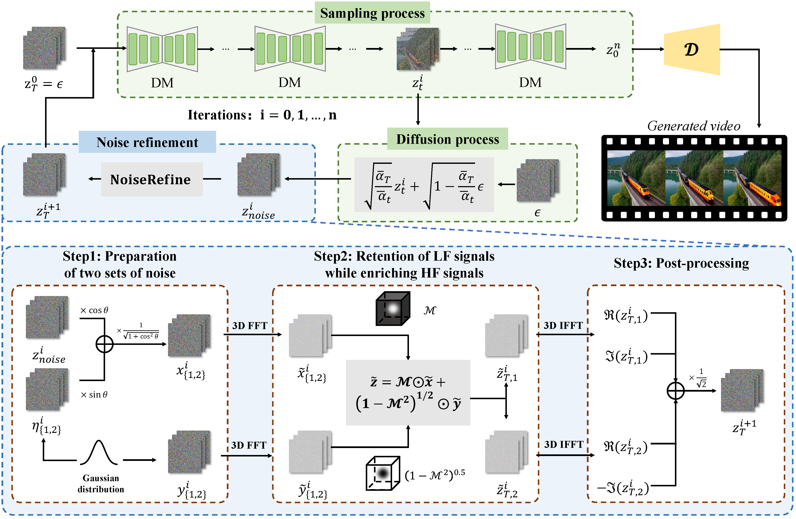

# FreqPrior: Improving Video Diffusion Models with Frequency Filtering Gaussian Noise


## 🛠️ Pipeline
<div align="center">
  
</div><br/>


## 📜 BibTeX
``` bibtex
@inproceedings{yuan2025freqprior,
  title={FreqPrior: Improving Video Diffusion Models with Frequency Filtering Gaussian Noise},
  author={Yunlong Yuan and Yuanfan Guo and Chunwei Wang and Wei Zhang and Hang Xu and Li Zhang},
  booktitle={International Conference on Learning Representations (ICLR)},
  year={2025}
}
```